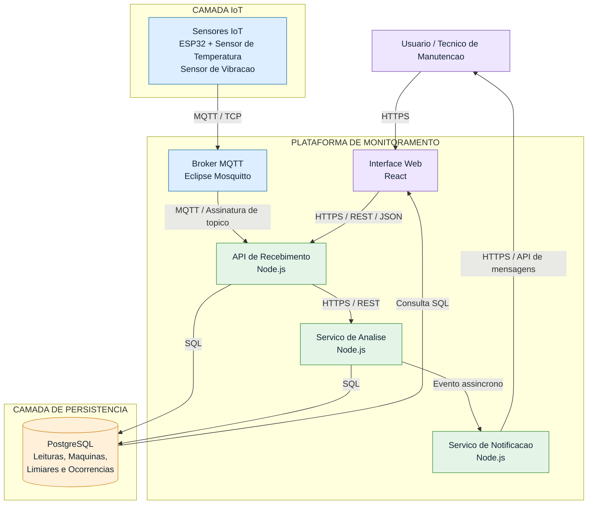

```mermaid
  
flowchart TB

    Usuario["Usuario / Tecnico de Manutencao"]

    subgraph IoT["CAMADA IoT"]
        Sensor["Sensores IoT<br/>ESP32 + Sensor de Temperatura<br/>Sensor de Vibracao"]
    end

    subgraph Plataforma["PLATAFORMA DE MONITORAMENTO"]
        MQTT["Broker MQTT<br/>Eclipse Mosquitto"]

        API["API de Recebimento<br/>Node.js"]

        Analise["Servico de Analise<br/>Node.js"]

        Notificacao["Servico de Notificacao<br/>Node.js"]

        Web["Interface Web<br/>React"]
    end

    subgraph Persistencia["CAMADA DE PERSISTENCIA"]
        DB[("PostgreSQL<br/>Leituras, Maquinas,<br/>Limiares e Ocorrencias")]
    end

    Sensor -->|"MQTT / TCP"| MQTT
    MQTT -->|"MQTT / Assinatura de topico"| API

    API -->|"HTTPS / REST"| Analise

    API -->|"SQL"| DB
    Analise -->|"SQL"| DB

    Analise -->|"Evento assincrono"| Notificacao

    Notificacao -->|"HTTPS / API de mensagens"| Usuario

    Web -->|"HTTPS / REST / JSON"| API
    Usuario -->|"HTTPS"| Web

    DB -->|"Consulta SQL"| Web

    classDef iot fill:#dceeff,stroke:#2874a6,color:#123
    classDef backend fill:#e4f5e8,stroke:#388e3c,color:#123
    classDef storage fill:#fff0d9,stroke:#d18b25,color:#123
    classDef frontend fill:#eee5ff,stroke:#8055b7,color:#123

    class Sensor,MQTT iot
    class API,Analise,Notificacao backend
    class DB storage
    class Web,Usuario frontend
```
