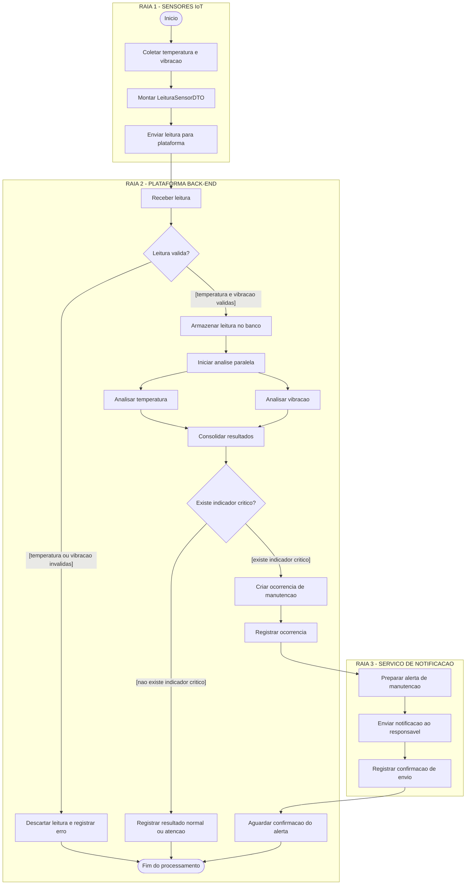

```mermaid
flowchart TD

    subgraph R1["RAIA 1 - SENSORES IoT"]
        A([Inicio])
        B["Coletar temperatura e vibracao"]
        C["Montar LeituraSensorDTO"]
        D["Enviar leitura para plataforma"]
    end

    subgraph R2["RAIA 2 - PLATAFORMA BACK-END"]
        E["Receber leitura"]
        F{"Leitura valida?"}
        G["Descartar leitura e registrar erro"]
        H["Armazenar leitura no banco"]
        I["Iniciar analise paralela"]

        J["Analisar temperatura"]
        K["Analisar vibracao"]

        L["Consolidar resultados"]
        M{"Existe indicador critico?"}
        N["Registrar resultado normal ou atencao"]
        O["Criar ocorrencia de manutencao"]
        P["Registrar ocorrencia"]
        Q["Aguardar confirmacao do alerta"]
        R([Fim do processamento])
    end

    subgraph R3["RAIA 3 - SERVICO DE NOTIFICACAO"]
        S["Preparar alerta de manutencao"]
        T["Enviar notificacao ao responsavel"]
        U["Registrar confirmacao de envio"]
    end

    A --> B --> C --> D --> E --> F

    F -->|"[temperatura e vibracao validas]"| H
    F -->|"[temperatura ou vibracao invalidas]"| G
    G --> R

    H --> I
    I --> J
    I --> K

    J --> L
    K --> L

    L --> M

    M -->|"[existe indicador critico]"| O
    M -->|"[nao existe indicador critico]"| N

    N --> R

    O --> P --> S
    S --> T --> U --> Q --> R
```
