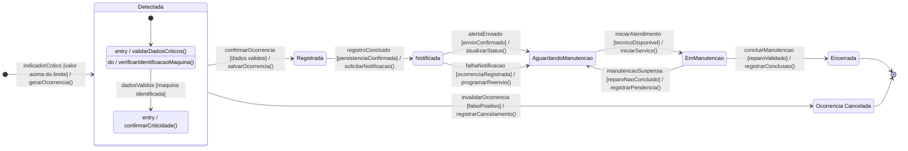

```mermaid

stateDiagram-v2

    direction LR

    [*] --> Detectada: indicadorCritico [valor acima do limite] / gerarOcorrencia()

    state Detectada {
        [*] --> Validando
        Validando: entry / validarDadosCriticos()
        Validando: do / verificarIdentificacaoMaquina()
        Validando --> Confirmada: dadosValidos [maquina identificada]
        Confirmada: entry / confirmarCriticidade()
    }

    Detectada --> Registrada: confirmarOcorrencia [dados validos] / salvarOcorrencia()

    Registrada --> Notificada: registroConcluido [persistenciaConfirmada] / solicitarNotificacao()

    Notificada --> AguardandoManutencao: alertaEnviado [envioConfirmado] / atualizarStatus()

    AguardandoManutencao --> EmManutencao: iniciarAtendimento [tecnicoDisponivel] / iniciarServico()

    EmManutencao --> Encerrada: concluirManutencao [reparoValidado] / registrarConclusao()

    Notificada --> AguardandoManutencao: falhaNotificacao [ocorrenciaRegistrada] / programarReenvio()

    EmManutencao --> AguardandoManutencao: manutencaoSuspensa [reparoNaoConcluido] / registrarPendencia()

    Encerrada --> [*]

    state "Ocorrencia Cancelada" as Cancelada
    Detectada --> Cancelada: invalidarOcorrencia [falsoPositivo] / registrarCancelamento()
    Cancelada --> [*]
```
