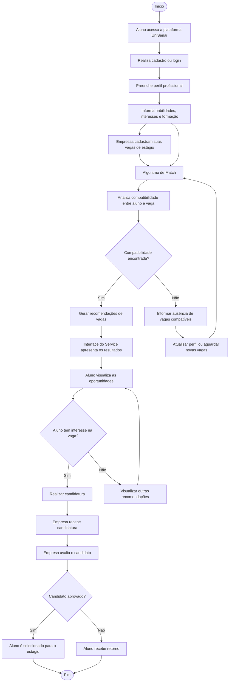

# Estágios UniSenai - Algoritmo de Match e Interfaces do Service

```mermaid
flowchart TD
    A([Início]) --> B[Aluno acessa a plataforma UniSenai]
    B --> C[Realiza cadastro ou login]
    C --> D[Preenche perfil profissional]

    D --> E[Informa habilidades, interesses e formação]
    E --> F[Empresas cadastram suas vagas de estágio]

    F --> G[Algoritmo de Match]
    E --> G

    G --> H[Analisa compatibilidade entre aluno e vaga]
    H --> I{Compatibilidade encontrada?}

    I -->|Sim| J[Gerar recomendações de vagas]
    I -->|Não| K[Informar ausência de vagas compatíveis]

    K --> L[Atualizar perfil ou aguardar novas vagas]
    L --> G

    J --> M[Interface do Service apresenta os resultados]
    M --> N[Aluno visualiza as oportunidades]
    N --> O{Aluno tem interesse na vaga?}

    O -->|Sim| P[Realizar candidatura]
    O -->|Não| Q[Visualizar outras recomendações]

    Q --> N
    P --> R[Empresa recebe candidatura]
    R --> S[Empresa avalia o candidato]
    S --> T{Candidato aprovado?}

    T -->|Sim| U[Aluno é selecionado para o estágio]
    T -->|Não| V[Aluno recebe retorno]
    
    U --> W([Fim])
    V --> W
```
