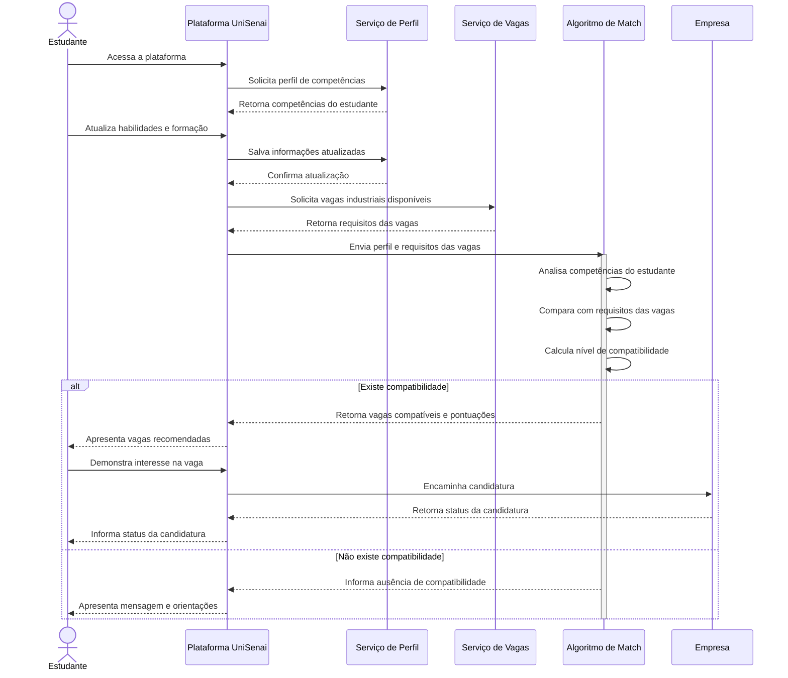

# Diagrama de Sequência - Conciliação de Competências UniSenai

```mermaid
sequenceDiagram
    actor Estudante
    participant Plataforma as Plataforma UniSenai
    participant Perfil as Serviço de Perfil
    participant Vagas as Serviço de Vagas
    participant Match as Algoritmo de Match
    participant Empresa

    Estudante->>Plataforma: Acessa a plataforma
    Plataforma->>Perfil: Solicita perfil de competências
    Perfil-->>Plataforma: Retorna competências do estudante

    Estudante->>Plataforma: Atualiza habilidades e formação
    Plataforma->>Perfil: Salva informações atualizadas
    Perfil-->>Plataforma: Confirma atualização

    Plataforma->>Vagas: Solicita vagas industriais disponíveis
    Vagas-->>Plataforma: Retorna requisitos das vagas

    Plataforma->>Match: Envia perfil e requisitos das vagas
    activate Match

    Match->>Match: Analisa competências do estudante
    Match->>Match: Compara com requisitos das vagas
    Match->>Match: Calcula nível de compatibilidade

    alt Existe compatibilidade
        Match-->>Plataforma: Retorna vagas compatíveis e pontuações
        Plataforma-->>Estudante: Apresenta vagas recomendadas

        Estudante->>Plataforma: Demonstra interesse na vaga
        Plataforma->>Empresa: Encaminha candidatura
        Empresa-->>Plataforma: Retorna status da candidatura
        Plataforma-->>Estudante: Informa status da candidatura

    else Não existe compatibilidade
        Match-->>Plataforma: Informa ausência de compatibilidade
        Plataforma-->>Estudante: Apresenta mensagem e orientações
    end

    deactivate Match
```
