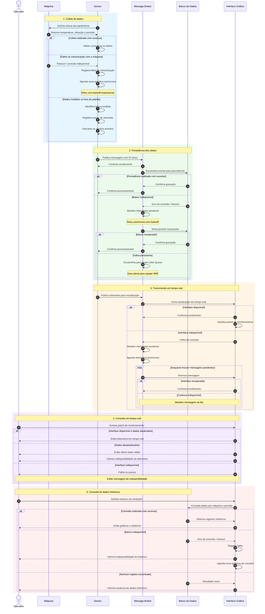

```mermaid

sequenceDiagram
    autonumber

    actor Operador
    participant Maquina as Máquina
    participant Sensor
    participant Broker as Message Broker
    participant Banco as Banco de Dados
    participant Interface as Interface Gráfica

    rect rgb(230, 245, 255)
        Note over Maquina,Sensor: 1. Coleta de dados

        Sensor->>Maquina: Solicita leitura dos parâmetros
        Maquina-->>Sensor: Retorna temperatura, vibração e pressão

        alt Coleta realizada com sucesso
            Sensor->>Sensor: Valida e processa os dados
        else Falha na comunicação com a máquina
            Maquina--xSensor: Timeout / conexão indisponível
            Sensor->>Sensor: Registra falha de comunicação
            Sensor->>Sensor: Agenda nova tentativa assíncrona
            Note over Sensor: Retry com backoff exponencial
        else Dados inválidos ou fora do padrão
            Sensor->>Sensor: Identifica leitura inválida
            Sensor->>Sensor: Registra evento de anomalia
            Sensor->>Sensor: Descarta ou sinaliza amostra
        end
    end

    rect rgb(235, 250, 235)
        Note over Sensor,Banco: 2. Persistência dos dados

        Sensor->>Broker: Publica mensagem com ID único
        Broker-->>Sensor: Confirma recebimento

        Broker->>Banco: Encaminha evento para persistência

        alt Persistência realizada com sucesso
            Banco-->>Broker: Confirma gravação
            Broker-->>Sensor: Confirma processamento
        else Banco indisponível
            Banco--xBroker: Erro de conexão / timeout
            Broker->>Broker: Mantém mensagem pendente
            Note over Broker: Retry assíncrono com backoff
            Broker->>Banco: Tenta persistir novamente

            alt Banco recuperado
                Banco-->>Broker: Confirma gravação
                Broker-->>Sensor: Confirma processamento
            else Falha persistente
                Broker->>Broker: Encaminha para Dead Letter Queue
                Note over Broker: Gera alerta para equipe SRE
            end
        end
    end

    rect rgb(255, 245, 230)
        Note over Sensor,Interface: 3. Transmissão em tempo real

        Sensor->>Broker: Publica telemetria para visualização
        Broker->>Interface: Envia atualização em tempo real

        alt Interface disponível
            Interface-->>Broker: Confirma recebimento
            Interface->>Interface: Atualiza painel de monitoramento
        else Interface indisponível
            Interface--xBroker: Falha de conexão
            Broker->>Broker: Mantém mensagem pendente
            Broker->>Broker: Agenda retentativa assíncrona

            loop Enquanto houver mensagens pendentes
                Broker->>Interface: Reenvia mensagem
                alt Interface recuperada
                    Interface-->>Broker: Confirma recebimento
                else Continua indisponível
                    Note over Broker,Interface: Mantém mensagem na fila
                end
            end
        end
    end

    rect rgb(245, 235, 255)
        Note over Operador,Interface: 4. Consulta em tempo real

        Operador->>Interface: Acessa painel de monitoramento

        alt Interface disponível e dados atualizados
            Interface-->>Operador: Exibe telemetria em tempo real
        else Dados desatualizados
            Interface-->>Operador: Exibe último dado válido
            Interface-->>Operador: Informa indisponibilidade da telemetria
        else Interface indisponível
            Interface--xOperador: Falha no acesso
            Note over Operador,Interface: Exibe mensagem de indisponibilidade
        end
    end

    rect rgb(255, 240, 240)
        Note over Operador,Banco: 5. Consulta de dados históricos

        Operador->>Interface: Solicita histórico de medições
        Interface->>Banco: Consulta dados por máquina e período

        alt Consulta realizada com sucesso
            Banco-->>Interface: Retorna registros históricos
            Interface-->>Operador: Exibe gráficos e relatórios
        else Banco indisponível
            Banco--xInterface: Erro de conexão / timeout
            Interface->>Interface: Registra falha
            Interface-->>Operador: Informa indisponibilidade do histórico
            Interface->>Interface: Agenda nova tentativa de consulta
        else Nenhum registro encontrado
            Banco-->>Interface: Resultado vazio
            Interface-->>Operador: Informa ausência de dados históricos
        end
    end
```