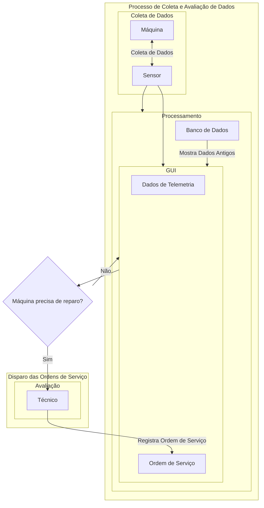

```mermaid
flowchart TD

    %%Vale ressaltar que esse diagrama NÂO está completo, ainda falta terminar.

   subgraph Processo de Coleta e Avaliação de Dados
        subgraph Coleta de Dados
            M[Máquina]
            S[Sensor]
        end


        subgraph Processamento
            DB[Banco de Dados]
            subgraph GUI
                DT[Dados de Telemetria]
                OS[Ordem de Serviço]


            end
            
        end


   end


   subgraph Disparo das Ordens de Serviço
    subgraph Avaliação
        T[Técnico]
    end
   end

    B@{ shape: "diamond", label: "Máquina precisa de reparo?" }

   M <-- Coleta de Dados --> S
   S ---> Processamento
   S ---> GUI
   DB -- Mostra Dados Antigos --> GUI
   GUI ----> B
   B -- Sim --> T
   B -- Não --> GUI
   T -- Registra Ordem de Serviço --> OS


   

    
```